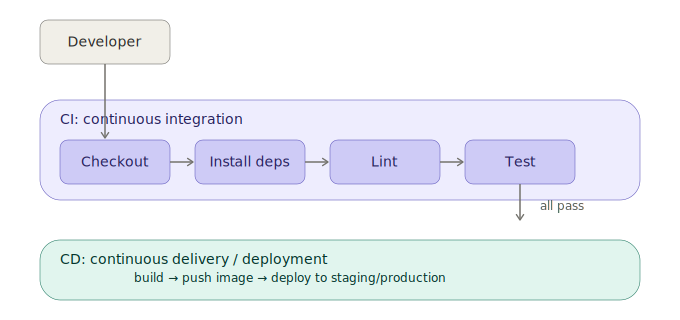

# What is CI/CD?

## The Problem CI/CD Solves

Imagine a team of 5 developers working on the same project. Each one writes
code on their own laptop. Without any process:

- Developer A finishes a feature and merges it — but never ran the tests.
- Developer B's code works on their machine but breaks on the server because
  they forgot to update a config file.
- Developer C manually uploads files to the production server via FTP at
  11 PM... and accidentally overwrites someone else's changes.

This is how software broke (and still breaks) in many real companies.
**CI/CD is the set of practices and tools that automate this entire process**,
so humans don't have to remember to do these things manually — and don't make
mistakes when they do.

## CI = Continuous Integration

**Continuous Integration** means: every time someone pushes code, an automated
process immediately:

1. Builds the project (compiles code, installs dependencies)
2. Runs automated tests (unit tests, integration tests)
3. Runs code quality checks (linting, formatting, security scans)
4. Reports back: ✅ pass or ❌ fail

**Goal:** Catch bugs and issues *immediately*, while the code change is still
fresh in the developer's mind — not three weeks later when nobody remembers
what changed.



If any CI step fails, the pipeline stops and reports ❌ — the developer fixes
the issue and pushes again. Only when everything passes does the pipeline
move on to the CD (delivery/deployment) stage.

## CD = Continuous Delivery / Continuous Deployment

These two terms are related but different:

### Continuous Delivery
After CI passes, the application is automatically **packaged and prepared**
for release (e.g., a Docker image is built and pushed to a registry), but a
**human still clicks a button** to actually release it to production.

### Continuous Deployment
This goes one step further — after CI passes, the application is
**automatically deployed to production** with no human intervention at all.

```
CI passes ✅
    │
    ▼
Build artifact (e.g., Docker image)
    │
    ▼
Push to registry (Docker Hub / GHCR / ECR)
    │
    ├──► Continuous Delivery: wait for manual approval ──► Deploy
    │
    └──► Continuous Deployment: deploy automatically ──► Production
```

## Why Do Companies Use CI/CD?

| Without CI/CD | With CI/CD |
|---|---|
| Manual testing before every release | Automated tests run on every change |
| "Works on my machine" bugs | Consistent environment via containers |
| Slow, risky, infrequent releases | Fast, frequent, low-risk releases |
| Hard to know what broke and when | Clear history of every change and its test result |
| Deployment is a stressful event | Deployment is routine and boring (a good thing!) |

## Key Vocabulary

| Term | Meaning |
|---|---|
| **Pipeline** | The full sequence of automated steps (build → test → deploy) |
| **Workflow** | A defined pipeline configuration (e.g., a `.yml` file) |
| **Job** | A group of steps that run on the same machine/runner |
| **Step** | A single command or action within a job |
| **Runner / Agent** | The machine (virtual or physical) that executes the pipeline |
| **Artifact** | A file produced by the pipeline (build output, test report, Docker image) |
| **Trigger** | An event that starts the pipeline (push, pull request, schedule, manual) |
| **Environment** | A target for deployment (development, staging, production) |
| **Secret** | Sensitive configuration (API keys, passwords) stored securely, not in code |

## The Three Levels in This Repo

This repository teaches CI/CD progressively:

1. **Basic** — Build, lint, and test your code automatically on every push.
   This is the foundation every project should have.

2. **Intermediate** — Add Docker image builds, dependency caching for speed,
   matrix builds (testing across multiple versions), and automated deployment
   to a staging environment.

3. **Advanced** — Add multi-environment deployments (staging → production),
   manual approval gates, security/vulnerability scanning, Kubernetes
   deployments, and rollback strategies.

Each level is implemented for **four different CI/CD platforms** (GitHub
Actions, GitLab CI, Jenkins, CircleCI) using **three sample applications**
(Node.js, Python, Java) — so you can learn the *concepts* once and see how
each tool expresses the same idea differently.

## Next Steps

- Read [`02-platforms-overview.md`](./02-platforms-overview.md) to understand
  how the four platforms compare.
- Then head to [`github-actions/basic/`](../github-actions/basic/) to see
  your first working pipeline.
