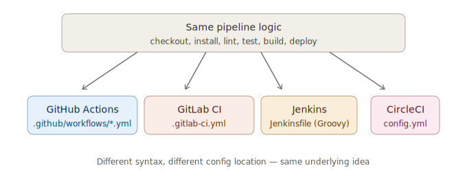

# CI/CD Platforms Overview

There are many CI/CD tools, but they all follow the same core idea: **listen
for an event (like a git push), then run a defined set of steps on a
runner/agent**. The differences are mostly in *syntax*, *where the pipeline
runs*, and *how configuration is structured*.

## Quick Comparison

| Feature | GitHub Actions | GitLab CI | Jenkins | CircleCI |
|---|---|---|---|---|
| **Config file** | `.github/workflows/*.yml` | `.gitlab-ci.yml` | `Jenkinsfile` (Groovy) | `.circleci/config.yml` |
| **Hosting** | Cloud (GitHub-hosted runners) or self-hosted | Cloud (GitLab.com) or self-hosted | Self-hosted (you run the server) | Cloud or self-hosted |
| **Setup difficulty** | Easy — built into GitHub | Easy — built into GitLab | Moderate/Hard — requires server setup | Easy — connect repo via web UI |
| **Best for** | Projects already on GitHub | Projects already on GitLab | Enterprises needing full control/customization | Teams wanting a dedicated CI cloud service |
| **Free tier** | Generous for public repos | Generous for public repos | Free (self-hosted), but you pay for the server | Free tier with limited credits |
| **Marketplace/Plugins** | "Actions" marketplace (huge ecosystem) | Built-in templates + custom images | Massive plugin ecosystem (oldest tool, most plugins) | "Orbs" (reusable config packages) |

## How Each One "Thinks"

### GitHub Actions
Organized around **Workflows** (files) → **Jobs** (run in parallel by
default, on separate runners) → **Steps** (run sequentially within a job).
Heavy use of pre-built community "Actions" (e.g., `actions/checkout@v4`)
which are reusable units of automation.

```yaml
jobs:
  build:
    runs-on: ubuntu-latest
    steps:
      - uses: actions/checkout@v4
      - run: npm install
```

### GitLab CI
Organized around a single `.gitlab-ci.yml` with **Stages** (run in order,
e.g., build → test → deploy) containing **Jobs** (jobs in the same stage run
in parallel).

```yaml
stages:
  - build
  - test

build-job:
  stage: build
  script:
    - npm install
```

### Jenkins
Organized around a `Jenkinsfile` written in **Groovy**, using a
**Declarative Pipeline** syntax with **Stages** and **Steps**. Jenkins itself
is software you install and run on a server (or container) — it's not a
hosted SaaS by default, which is why it needs more setup.

```groovy
pipeline {
    agent any
    stages {
        stage('Build') {
            steps {
                sh 'npm install'
            }
        }
    }
}
```

### CircleCI
Organized around `.circleci/config.yml` with **Jobs** grouped into
**Workflows** that define the order and dependencies between jobs. Uses
"Orbs" — reusable, shareable packages of config (similar to GitHub Actions).

```yaml
version: 2.1
jobs:
  build:
    docker:
      - image: cimg/node:20.0
    steps:
      - checkout
      - run: npm install

workflows:
  main:
    jobs:
      - build
```

## Mapping the Same Pipeline Across All Four

Throughout this repo, you'll see the **same logical pipeline** —
checkout → install → lint → test → build → deploy — expressed in each
platform's syntax. This is intentional: once you understand the *concept*,
switching tools mostly becomes a "translation" exercise.



## Which Should You Learn First?

If you're starting from scratch: **GitHub Actions** is the easiest entry
point because it's built directly into GitHub — no extra accounts or servers
needed. That's why this repo starts there. Once the concepts click, the other
platforms in this repo (`gitlab-ci/`, `jenkins/`, `circleci/`) will feel
familiar — same ideas, different syntax.
